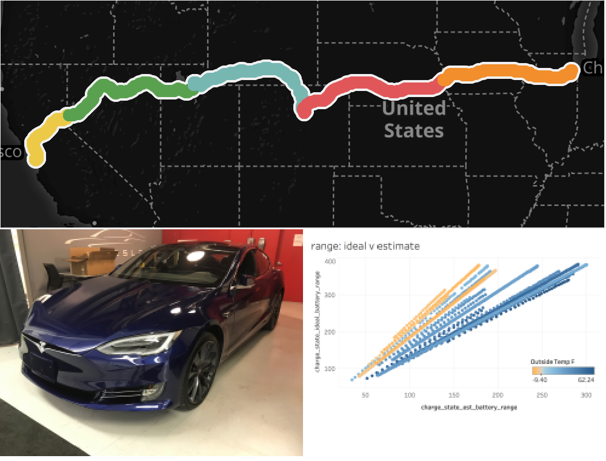
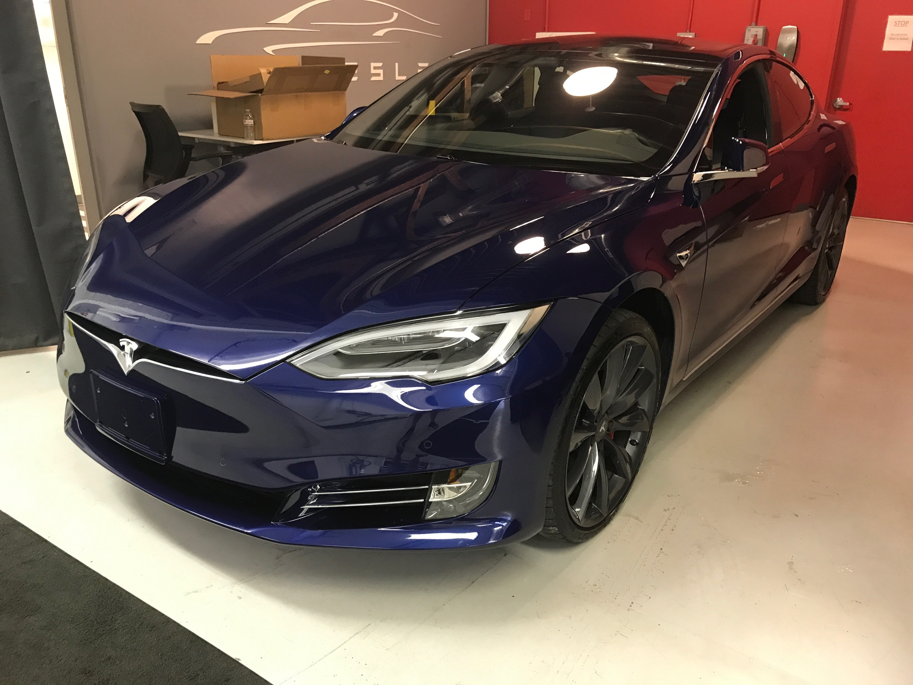
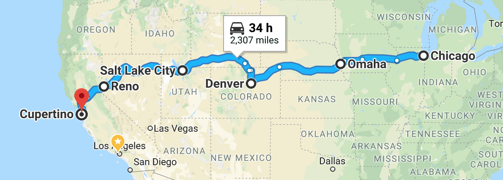
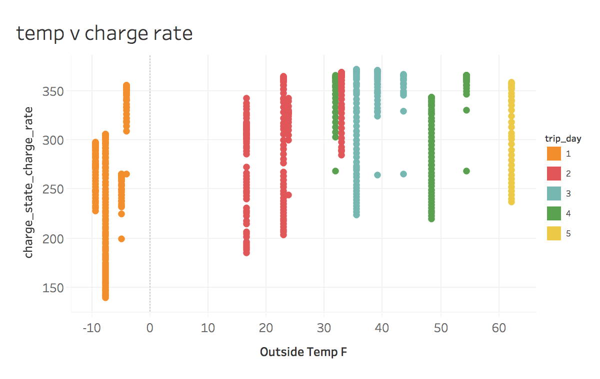
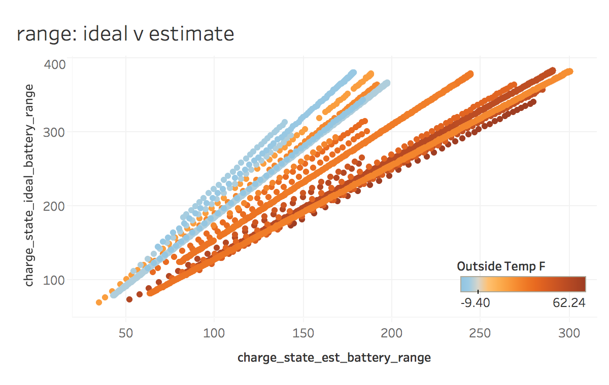
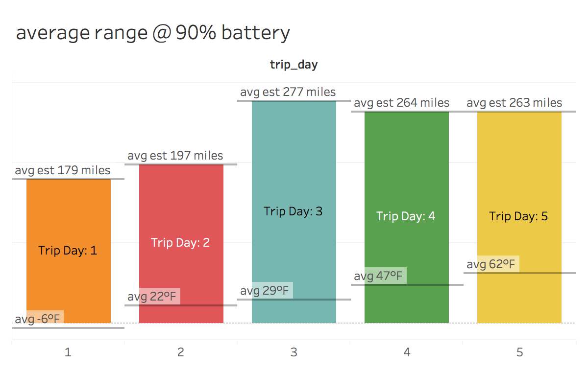

A 2,386.7 mile Tesla Road Trip, measured with data
<!-- TOC depthFrom:1 depthTo:6 withLinks:1 updateOnSave:1 orderedList:0 -->

- [Summary](#summary)
	- [The car](#the-car)
	- [The tech (AWS EC2 + RDS)](#the-tech-aws-ec2-rds)
	- [The code (R + Tableau)](#the-code-r-tableau)
		- [R](#r)
		- [Tableau](#tableau)
- [Driving Experience](#driving-experience)
	- [Overall Experience](#overall-experience)
	- [Snow + Cold Weather](#snow-cold-weather)
	- [Cold weather’s impact on range and charging, discussed](#cold-weathers-impact-on-range-and-charging-discussed)
	- [Supercharger experience](#supercharger-experience)
	- [Navigation System Struggles](#navigation-system-struggles)
	- [AutoPilot Hiccups](#autopilot-hiccups)
- [Data Points](#data-points)
	- [Manual Data](#manual-data)
	- [Overall Trip Metrics](#overall-trip-metrics)
	- [Charge Data](#charge-data)
	- [Charging Time Impact on Total Time](#charging-time-impact-on-total-time)
	- [Cold weather's impact on range and charging, visualized](#cold-weathers-impact-on-range-and-charging-visualized)
		- [Charge Rate Influenced by cold weather](#charge-rate-influenced-by-cold-weather)
		- [Cold Impact on Estimated Range v Ideal Range](#cold-impact-on-estimated-range-v-ideal-range)
		- [Average Range @ 90% Battery](#average-range-90-battery)
	- [Regenerative Braking](#regenerative-braking)
- [regen braking on trip days 3-4](#regen-braking-on-trip-days-3-4)

<!-- /TOC -->

# Summary



At the start of the new year, my brother and I went on a road trip from Chicago, IL, to Cupertino, CA.  The fun part was that we were driving a Tesla Model S P100D.  The nerdy part was that we regularly pinged a Tesla API to retrieve data from the car all along the route. Aside from using the trip computer to regularly report our mileage and energy usage, I ended up with a bunch of great data that I can analyze and visualize... in addition to driving a Model S.

Below documents our five day road trip. I write about the experience taking a Tesla Model S on a cross-country trip and provide some code and visuals on a few of the topics that came to mind.  As time allows, I will be returning to this page to expand on the analyses and build some statistical models.

- - - -
## The car
The car we drove was a 2016 Model S P100D:

>
>*The beast, the beauty: the P100D.*

My brother picked up this car to help with his 80 mile total commute to/from Downtown Chicago to North Chicago, IL.   For those of you familiar with Interstate 90/94 know that means one thing: ouch.  With a new opportunity in California, he opted to drive his car himself instead of rely on an uncovered transport.  We have done road trips before and this was the perfect opportunity to see how the Model S would perform on a long distance cruise.

>
>*Leaving the Sales center*.

## The tech (AWS EC2 + RDS)
Each Tesla vehicle has a cellular data modem built into the car to enable various features: software updates, live traffic, streaming radio, etc…. Turns out, there’s an API available to retrieve data from the car.  Tim Dorr provides an unofficial document on how to interact with this API at [Tesla Model S JSON API · Apiary](https://timdorr.docs.apiary.io/#).  I asked Reddit about best practices of tracking data at [Questions for upcoming road trip: charging frequency & extracting/analyzing trip data : teslamotors](https://www.reddit.com/r/teslamotors/comments/7mp56a/questions_for_upcoming_road_trip_charging/) where `u/Doctor_McKay` offered up a repo where he build an app to regularly ping a Tesla vehicle based on the vehicle’s current state (parked, driving, charging, etc…) Using his repo available on  [GitHub](https://github.com/DoctorMcKay/node-tesla-data), I worked with a friend to get this app running on AWS.

The AWS setup was pretty simple.  We booted up a Linux EC2 instance (first an m4.large, way oversized, then downsized to a t2.micro) and cloned `u/Doctor_McKay`’s repo.  I modified the wait timers so that the program was pinging the API every minute.  Working with my friend, we wanted to try and make this as resilient as possible.  As a result, we made three decisions with running this app:

1. We used a MySQL instance via AWS RDS instead of installing MySQL on our EC2 instance.  The logic here was that if the compute instance had a problem then the database would be isolated.

2. We wrote a quick bash script and ran it every minute via crontab to make sure the program was running.  This was a bit of overkill as `u/Doctor_McKay`’s code already had [foreverjs/forever](https://github.com/foreverjs/forever) included but we wanted to make absolutely sure the program would resume if it were stopped for any reason.

3. We setup a Simple Notification Service (SNS) topic to text our phones if the compute instance state changed from something other than running.

## The code (R + Tableau)
### R
The data extraction and basic manipulation was done in R.  The main packages used was `dplyr` for data manipulation, `lubridate` for date manipulation, and `DBI` for database queries.  Two main files support what you see here:
1. [work_results.R](data/work_results.R): This file that queried the database, parsed the JSON columns, and wrote data objects to disk.
	* I am not pleased the function I wrote to parse the JSON statements.  The challenge here was that these were saved in a database column.  I tried various `apply` and `lappy` approaches to no avail.  I ended up writing a `for (i in json_list){...}` function that worked great but took over 10 minutes to parse through ~44k JSON items.
2. [analysis.R](data/analysis.R): This file performs practically all the data wrangling to help prepare and show the analyses performed below.

### Tableau
Tableau was used for all visualizations other than the markdown tables below.  Why use Tableau over `ggplot`?  Simply put: for the sake of speed.  I use Tableau on a daily basis so it is much faster for me to iterate with ideas in Tableau instead of plotting via `ggplot`... that could change in the future, though.


# Driving Experience
## Overall Experience
The below sections focus on some of the negatives we experienced on our trip.  However, it is not fair to say my overall experience driving the Model S was negative.  In fact, it is quite the opposite: driving this car was amazing.

Driving a Tesla is unlike any over vehicle I have driven.  There is so much technology in the car that it is easy to forget the P100D is a high-end performance vehicle.  The thrill of driving is similar to driving a German automobile: there is a genuine connection between you and the road. The connection that BMWs and Audis offer are the rumble of the engine and the texture of the road felt through the steering wheel.  In a Tesla, the connection is much more technical: a driver display with the traditional telemetry information along with lane positioning, sensor reading/warning, nearby vehicle information, and more.  It is a hybrid physical+technical feeling that I have yet to experience anywhere else.

## Snow + Cold Weather

My brother’s car had the performance wheels swapped for snow tires to compensate for the winter weather in Chicago.  Snow tires along with the weight of the vehicle (mostly battery)  made the Model S feel like a tank regardless of how much snow and/or ice was on the road.  Compared to the 2013 BMW 335xi I was also driving during the holiday season, there was certainly a greater feeling of safety when coming to a stop in the Model S.  I only recall engaging the ABS system once in the Model S whereas I was regularly engaging ABS in the BMW.

Cold weather really impacted the driving feel of the car.  Compared to driving it in warmer weather, the Model S didn’t have the same punch or feel regardless of whether the acceleration mode was set to Chill or Ludicrous.  Once you drove the car for 30-45 minutes, though, responsiveness improved.  Even with the car being warmed up, the snow+ice offered zero opportunity to push the car to its limits.  

As far as comfort goes, we found ourselves regularly using seat warmers to complement the car’s resistance heaters for raising the temperature of the cabin.  In super cold weather, where we were constantly below 0°F, we found ourselves setting the heat to higher than our preferred temperatures to stay comfortable.  We engaged Range Mode once to see how different the climate system would feel. We certainly felt a difference: heat from the vents felts noticeably cooler and our leg space was cold.  At no point were we in danger of freezing, though.

## Cold weather’s impact on range and charging, discussed
The most disappointing part of this experience was just how detrimental cold weather was on the Model S’s battery.  Cold weather caused both significant drops in range along and increased charge times.  The main culprit was that the battery would use a portion of its stored energy to keep itself at a safe operating temperature.  Cold weather also impacted the car’s routing ability.  Whenever we drove in extreme colds, the range would regularly decrease to the point where the car would not make it to the Supercharger it planned.  Only one time did the routing system reroute to a closer Supercharger.  All other times the Trip screen would decrement the battery until it was depleted, warn us to slow down to extended range, and then never state there was a closer Supercharge on route.  We ended up always setting one of our cell phones to the closest Supercharger on route to avoid being stuck between Superchargers in the cold.

## Supercharger experience
We never had a problem finding or plugging in at a Supercharger.  Cold weather impacted the time it took to charge, though, especially if the car did not get 30-45 minutes of drive time prior to charging.  The locations of the Superchargers were not always ideal, though.  In Illinois, the Superchargers were in large retail (non-food) shopping centers so it was not always easy to find restrooms or coffee/snacks.  In Iowa, the Superchargers were located in Hy-Vee and were always really accommodating with mini-restaurants or coffee shops inside.  In Nebraska and Utah, Superchargers were located in hotel parking lots; stepping in to the lobby to relax and hit the restrooms were fine but sometimes awkward if it was a small hotel and the front desk did not recognize us.  In Wyoming, Superchargers were located near shopping malls and were the most convenient in terms of finding things to do while we waited.  In Nevada, Superchargers were in Chevron stations and always had a casino nearby or attached (go figure).

## Navigation System Struggles
For a car as technologically advanced as the Model S, the navigation system does not perform well compared against Google Maps navigation.  Elon Musk [tweeted](https://twitter.com/elonmusk/status/943878616454127616?lang=en) that an update to navigation is coming early this year, but until then we experienced things like:
* Inconsistent road names used between screens: the main screen used county/route numbers while driver screen used formal name and exit numbers.  I preferred the driver screen's name and exit number, but they did not appear until you were approaching the next turn.
* Bad routing through downtown location: we ended up swapping to phone navigation through downtowns like Omaha and Denver as the Tesla navigation was regularly rerouting.  We drove through both those cities in the evening, so I cannot imagine traffic being a factor.
* Trying to manually reroute to closer Superchargers was problematic.  Accidental taps on the screen would cancel the current route which reset the trip metrics displayed on the consumption screen.

## AutoPilot Hiccups
We probably spent >90% of our time on interstates cruising with both traffic aware cruise control and auto-steer enabled.  The few times we chose to manually control the car was when we were getting ready to exit or driving through curvy mountain roads when the Model S would prefer to hug a side.

We regularly encountered hiccups when it came to bouncing in a straight lane (ping-pong) or losing center when a new lane or exit ramp would appear.
* Ping-pong: This happened more often on roads covered with salt than clear roads.  Essentially the car would gradually rock back and forth from the left lane marker to the right lane marker.  Really need to emphasis the word gradual here; we were never close to crossing a lane marker.  After several hours of driving, though, it did become annoying as if we were on a swaying boat.  Fortunately once we left the snow covered parts of Illinois and Iowa, the occurrence rate dropped significantly.
* New lanes & exit ramps: We experienced this fairly often.  Essentially what would happen is that the Model S would cruise along locked on to both the right and left lane marker.  One of the markers would disappear to accommodate an upcoming new lane or exit ramp. It felt as though the car would interpret the missing lane marker as though it lost track of the center of the lane and would begin drifting in the direction of the missing lane marker to find it.  Suddenly the lane marker would reappear (we never drifted into the new lane, just towards it) and the car would juke in the opposite direction to reposition itself in the center of the lane.

# Data Points
## Manual Data
As much as I would love to say that all this data capture was automated, I had to manually declare where each day stopped and started.  I experimented with a few different methods to automate this discovery: changes in GPS coordinates, changes in drive state, changes in charge state, etc..  Unfortunately, like many real world datasets, small things like moving the car in a driveway, driving through a parking garage, updating software all resulted in false positives with start/end times in this dataset.  As a result, I took to Tableau to list all the timestamps, created a control parameter so I could convert the time to various timezones, then looked for where I could positively identify when we plugged in for an overnight charge.  In order to use the data with my other R objects, I wrote the following `tibble`:
```r
man_trip_times <- frame_data(
  ~'day', ~'event', ~'start', ~'end',            # recording in epoch time
  1, 'transit', 1514830569, 1514874446,          # Chicago to Omaha
  1, 'overnight charge', 1514874507, 1514912977, # Omaha hotel
  2, 'transit', 1514913039, 1514954481,          # Omaha to Denver
  2, 'overnight charge', 1514954543, 1514998907, # Denver hotel
  3, 'transit', 1514998968, 1515038915,          # Denver to Salt Lake City
  3, 'overnight charge', 1515038975, 1515085120, # Salt Lake City hotel
  4, 'transit', 1515085181, 1515120812,          # Salt Lake City to Reno
  4, 'overnight charge', 1515120872, 1515184304, # Reno hotel
  5, 'transit', 1515184364, 1515207813           # Reno to Cupertino
  ) %>%
  mutate(duration = end - start
         ,running_duration = cumsum(duration)
         )
```

With that bit of data available, I was able to write two custom functions to help classify each timestamp’s day and event:
```r
>> add an event label based off unix timestamp
determine_label_event <- function(unixtimestamp){
  result = man_trip_times$event[unixtimestamp >= man_trip_times$start & unixtimestamp <= man_trip_times$end]
  result = if(length(result) == 0L){'out of bounds'}else{result}
  return(result)
}

>> add an event day based off unix timestamp
determine_label_day <- function(unixtimestamp){
  result = man_trip_times$day[unixtimestamp >= man_trip_times$start & unixtimestamp <= man_trip_times$end]
  result = if(length(result) == 0L){0}else{result}
  return(result)
}
```

Thinking back, I could have just wrote one function, returned a lookup key, then joined the datasets together.  Next time.  

With the trip day and distinction between ‘transit’ and ‘overnight charge’ appended to each record, I can now aggregate data per trip day while ignoring impacts from overnight charging.

## Overall Trip Metrics
Our trip consisted of five days starting in Chicago and stopping in Omaha, Denver, Salt Lake City, Reno, and finally Cupertino.  Using the data captured from the Tesla API, we can visualize our path across the US and measure the distance and time of our trip:

>
>*Tableau plotted GPS coordinates of each data point captured via the Tesla API.*

| trip_day| avg_temp_f| miles_traveled| running_miles| time_hrs| running_time_hrs|
|--------:|----------:|--------------:|-------------:|--------:|--------:|
|        1|       -7.0|          485.2|         485.2|     12.2|     12.2|
|        2|       21.5|          561.5|        1046.7|     11.5|     23.7|
|        3|       35.0|          536.0|        1582.7|     11.1|     34.8|
|        4|       44.3|          543.2|        2125.9|      9.9|     44.7|
|        5|       56.9|          261.7|        2387.6|      6.5|     51.2|


As you can see from the average temperature of -7°F, we hit some really cold weather our first day.  In fact, nearly our entire trip through Iowa was under 0°F:

>
>*Outside weather recorded via the Model S*

## Charge Data
I wanted to be able to understand (1) how many times we had to stop and charge and (2) how much of our trip was spend charging.  With `charge_state` being reported by the Model S, I was successful in determining start/end times of each charging occurrence via:
```r
 ## create subset for charging questions
charge_tesla <- raw_tesladata %>%
  filter(trip_day != 0) %>% # ignoring data outside the bound of our roadtrip
  filter(trip_event == 'transit') %>% # ignoring overnight charging sessions
  select(unixtime, timestamp, trip_day, trip_event, battery_level
         ,outside_temp_f, latitude, longitude, contains('charge_state'))

 ### create subset focused on start/end times
charge_start_end <- charge_tesla %>%
  select(unixtime, timestamp, trip_day, trip_event
         ,battery_level, outside_temp_f, latitude, longitude
         ,charge_state_charging_state, charge_state_charge_miles_added_rated
         ,charge_state_charge_miles_added_ideal
         ) %>%
  # find the instance where the charge state changed
  mutate(charge_state_charging_state = if_else(charge_state_charging_state == 'Starting'
                                               , 'Charging'
                                               , charge_state_charging_state)
         ) %>%
  mutate(event_time = if_else(charge_state_charging_state == lag(charge_state_charging_state)
                              , 'SAME'
                              , 'CHANGE'
                              )
         ) %>%
  filter(event_time == 'CHANGE') %>% # focus on where changes occurred
  mutate(next_timestamp = lead(timestamp)) %>% # peek ahead to see when the charge state ended
  filter(charge_state_charging_state == 'Charging') %>% # drop records where changing stopped
  mutate(duration = as.numeric(next_timestamp - timestamp)) # calculate charge duration

 # summarize charge data
charge_start_end_summary <- charge_start_end %>%
  group_by(trip_day) %>%
  summarize(charges = n()
            ,chrg_time_hrs = round(sum(duration) / 60,1)
            ) %>%
  ungroup(.) %>%
  mutate(running_chrg_time_hrs = cumsum(chrg_time_hrs))
```

Which enables us to view a summary of the time spent charging:

| trip_day| charges| chrg_time_hrs| running_chrg_time_hrs|
|--------:|-------:|-------------:|---------------------:|
|        1|       4|           3.2|                   3.2|
|        2|       4|           3.3|                   6.5|
|        3|       3|           1.7|                   8.2|
|        4|       3|           1.8|                  10.0|
|        5|       2|           0.6|                  10.6|

## Charging Time Impact on Total Time
According to Google, a non-stop trip from Chicago to Cupertino with our stops along the way should take 34 hours:
>
>*via: [Google Maps](https://www.google.com/maps/dir/Chicago,+Illinois/Omaha,+Nebraska/Denver,+CO/Salt+Lake+City,+UT/Reno,+NV/Cupertino,+CA/@39.2931808,-122.1798206,4.2z/data=!4m38!4m37!1m5!1m1!1s0x880e2c3cd0f4cbed:0xafe0a6ad09c0c000!2m2!1d-87.6297982!2d41.8781136!1m5!1m1!1s0x87938dc8b50cfced:0x46424d4fae37b604!2m2!1d-95.9979883!2d41.2523634!1m5!1m1!1s0x876b80aa231f17cf:0x118ef4f8278a36d6!2m2!1d-104.990251!2d39.7392358!1m5!1m1!1s0x87523d9488d131ed:0x5b53b7a0484d31ca!2m2!1d-111.8910474!2d40.7607793!1m5!1m1!1s0x809940ae9292a09d:0x40c5c5ce7438f787!2m2!1d-119.8138027!2d39.5296329!1m5!1m1!1s0x808fb4571bd377ab:0x394d3fe1a3e178b4!2m2!1d-122.0321823!2d37.3229978!3e0)*

However, looking at our [Overall Trip Metrics](#overall-trip-metrics) this trip took us a total of 51.2 hours in transit.  What would our trip look like if we reduced charge instances to 30 minutes or we never stopped for charging?

First, let's get the data calculated in R:
```r
 # what if: charge time was only 30 minutes |OR| there were no charge stops
reduced_stops <- summary_tesla %>%
  left_join(charge_start_end_summary) %>%
  select(trip_day, time_hrs, chrg_time_hrs, charges) %>%
  mutate(time_hrs_red_chrg = time_hrs - chrg_time_hrs + (charges * .5)
         ,time_hrs_no_chrg = time_hrs - chrg_time_hrs) %>%
  select(-chrg_time_hrs, -charges) %>%
  mutate(running_time_hrs = cumsum(time_hrs)
         ,running_time_red_hrs = cumsum(time_hrs_red_chrg)
         ,running_time_no_hrs = cumsum(time_hrs_no_chrg)
         )

kable(reduced_stops %>% select(trip_day, time_hrs, time_hrs_red_chrg, time_hrs_no_chrg))
kable(reduced_stops %>% select(trip_day, running_time_hrs, running_time_red_hrs, running_time_no_hrs))
```

| trip_day| time_hrs| time_hrs_red_chrg| time_hrs_no_chrg|
|--------:|--------:|-----------------:|----------------:|
|        1|     12.2|              11.0|              9.0|
|        2|     11.5|              10.2|              8.2|
|        3|     11.1|              10.9|              9.4|
|        4|      9.9|               9.6|              8.1|
|        5|      6.5|               6.9|              5.9|

| trip_day| running_time_hrs| running_time_red_hrs| running_time_no_hrs|
|--------:|----------------:|--------------------:|-------------------:|
|        1|             12.2|                 11.0|                 9.0|
|        2|             23.7|                 21.2|                17.2|
|        3|             34.8|                 32.1|                26.6|
|        4|             44.7|                 41.7|                34.7|
|        5|             51.2|                 48.6|                40.6|

And in case the naming isn't clear:
* `time_hrs_red_chrg` means 'time in hours with reduced charges'
* `time_hrs_no_chrg` means 'time in hours without charge stops'
* `running_time_red_hrs` means 'running time with reduced charges'
* `running_time_no_hrs` means 'running time without charge stops'

A few observations include:
* Day 5 would have actually been slightly longer since we were getting long ranges and fast charging in California.
* Reduced charges would have reduced our running time by 5%.
* No charging stops would have reduced our running time by 11.6%
	* However, even in an internal combustion engine (ICE) vehicle, we still would have had to make stops.

## Cold weather's impact on range and charging, visualized

### Charge Rate Influenced by cold weather
Looking at the data captured by the car, the car recorded the outside temperature along with the rate of charge (Wh).  I created a scatter plot to examine outside temperature and rate of charge and ended up with this:

>
>*Each point represents the rate of charge against outside temperature while the car reported being in a 'charging' state.  This graphic ignores overnight charging.*

Day 1, colored in orange with an average temp of -7.0°F, shows the largest range of charge rate: between 140 Wh & 355 Wh.  Day 5, colored in yellow with an average temperature of 56.9°F, saw a much smaller range of charge: between 235 Wh & 360 Wh.

### Cold Impact on Estimated Range v Ideal Range
Each time you ping the car while it is charging, it will report back two measures of the mileage range: estimated range and ideal range.  The estimated range tries to measure how many miles you will be able to travel based on recent power usage patterns.  The ideal range, as you guessed, is the ideal range the car can travel if power usage was consumed in optimal conditions (lower speeds, fair climate, etc...).  Again using a scatter plot we can see how colder temperatures impacted the relationship between these two measures:

>
>*Each point represents the reported estimated range and ideal range colored by the outside temperature at the time of charging.  This graphic ignores overnight charging.*

In this graphic, we can see cold weather impacted the relationship between ideal range and estimated range.  Looking at the data supporting this chart, it appears that estimated range reaches closer to ideal range when the temperature is above 32°F.  However, there was never a data point that had the ideal range equaling the estimated range.

### Average Range @ 90% Battery
To get a sense of the overall impact of weather on estimated range, let's calculate the average estimated range against average outside temperature when the battery reported 90%:

>
>*Average of reported estimated range and outside temperature per trip day inclusive of overnight charging.*

Ignoring all other factors, the car reported 47% less range between Trip Day 1 (really cold) against Trip Day 4 (moderately cold).

## Regenerative Braking
In the previous graphic, you will notice a higher range for Trip Day 3 than Trip Days 4 & 5.  We maintained a pretty similar drive style across all days, so I was surprised to see Day 3 with about 5% more range.  I recalled that we regularly decreased altitude between Denver and Salt Lake City so I thought I would take a glance at regenerative braking as a possibility for increased range:

>
>*Power usage reported when going faster than 40MPH per trip day.  Amounts greater than zero are instances of energy consumption.  Amounts less than zero are instances are energy regeneration.*

Results are inconclusive.

In in the colder weather experienced on Trip Days 1 & 2, regenerative braking did not occur as Tesla normally do not recapture energy in cold weathers.

If we analyze the occurrences of CONSUME/REGEN on the latter trip days, we find:

```r
# regen braking on trip days 3-4
regen_braking <- raw_tesladata %>%
 select(timestamp, trip_day, trip_event, speed, drive_state_power) %>%
 filter(trip_day > 2 # focus on trip days 3-5
				,trip_event == 'transit' # focus on when the car is in transit
				,speed > 40 # focus on records when the car was faster than 40MPH
				) %>%
 mutate(power = as.numeric(drive_state_power) # reset data type
				,energy_state = if_else(power > 0, 'CONSUME','REGEN') # label consumption v regeneration
				) %>%
 group_by(trip_day, energy_state) %>%
 summarise(count = n()
					 ,avg_wh = round(mean(power),1)
					 )

kable(regen_braking)
```

| trip_day|energy_state | count| avg_wh|
|--------:|:------------|-----:|------:|
|        3|CONSUME      |   325|   29.7|
|        3|REGEN        |    28|  -20.5|
|        4|CONSUME      |   366|   31.9|
|        4|REGEN        |    15|  -24.6|
|        5|CONSUME      |   156|   28.9|
|        5|REGEN        |    49|  -13.4|

Our highest occurrence of regeneration occurred on Trip Day 5 but at our lowest average watt hour (wH).  Makes sense considering we spent a lot of time in California traffic during afternoon rush hour.  Trip Day 4 had the greatest regenerative braking average wH but at a lower occurrence that Trip Day 3.  Without slicing this data further, there is not overwhelming evidence that regenerative braking impacted Trip Day 3's average estimated range.
