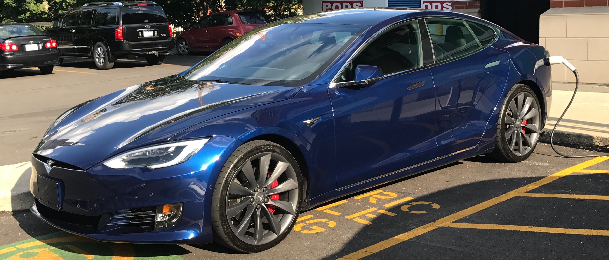
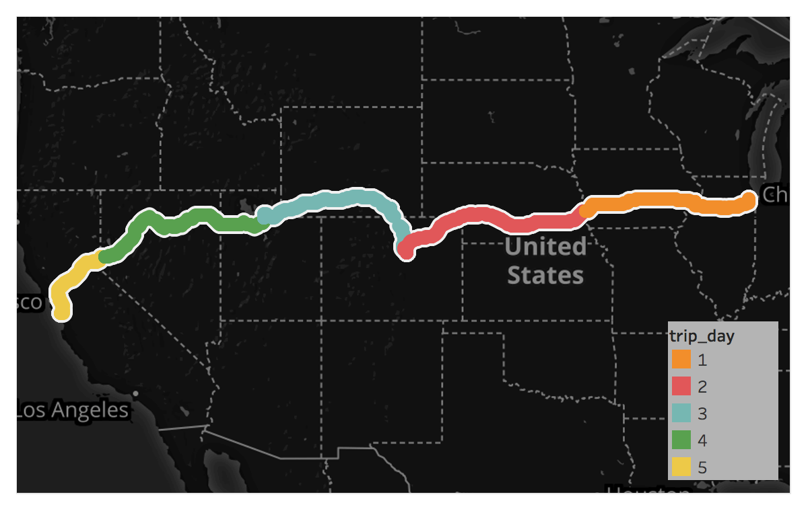
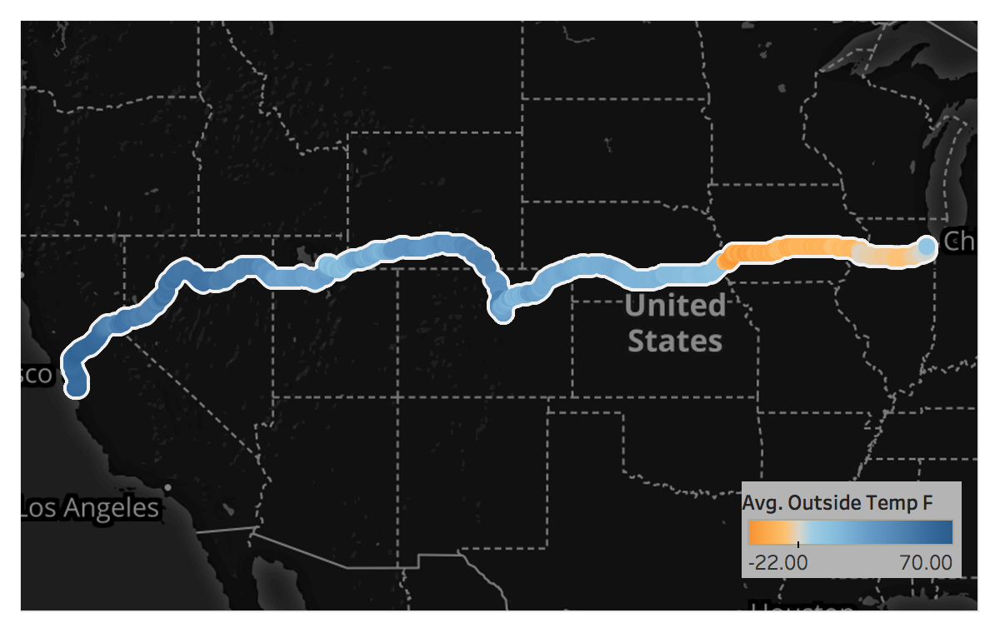
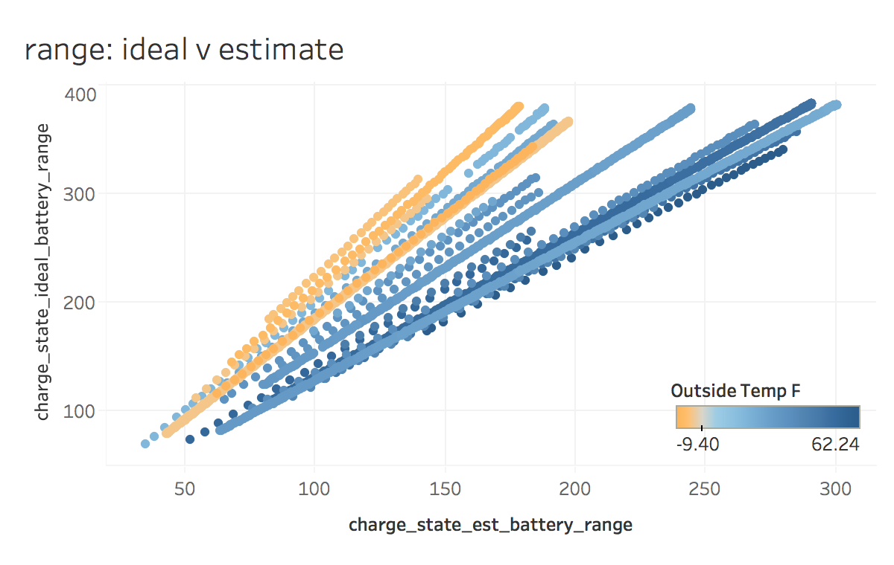

A 2,386.7 mile Tesla Road Trip, measured with data
<!-- TOC depthFrom:1 depthTo:6 withLinks:1 updateOnSave:0 orderedList:0 -->

- [Summary](#summary)
	- [The car](#the-car)
	- [The tech (AWS EC2 + RDS)](#the-tech-aws-ec2-rds)
	- [The code (R + Tableau)](#the-code-r-tableau)
- [Driving](#driving)
	- [Snow + Cold Weather](#snow-cold-weather)
	- [Cold weather’s impact on range and charging, discussed](#cold-weathers-impact-on-range-and-charging-discussed)
	- [Navigation System Struggles](#navigation-system-struggles)
	- [AutoPilot Hiccups](#autopilot-hiccups)
- [Data](#data)
	- [Manual Data](#manual-data)
	- [Overall Trip Metrics](#overall-trip-metrics)
	- [Charge Data](#charge-data)
	- [Cold weather's impact on range and charging, visualized](#cold-weathers-impact-on-range-and-charging-visualized)
		- [Charge Rate Influenced by cold weather](#charge-rate-influenced-by-cold-weather)
		- [Cold Impact on Estimated Range v Ideal Range](#cold-impact-on-estimated-range-v-ideal-range)

<!-- /TOC -->

# Summary
At the start of the new year, my brother and I went on a road trip from Chicago, IL, to Cupertino, CA.  The fun part was that we were driving a Tesla Model S P100D.  The nerdy part was that we regularly pinged a Tesla API to retrieve data all along the route.  So aside from using the trip computer to regularly report our mileage and energy usage, we have a bunch of great data that we can analyze and visualize with.  

Below documents our five day road trip. I write about the experience taking a Tesla Model S on a cross-country trip, provide some code snippets that helped get the data ready for analysis, deep dive into a few stories the data can tell us, then conclude with my own decision about owning a Tesla.

- - - -
## The car
The car we drove was a 2016 Model S P100D:

>
>*The beast, the beauty: the P100D.*

My brother picked up this car to help with his 80 mile total commute to/from Downtown Chicago to North Chicago, Illinois.   For those of you familiar with Interstate 90/94 know that means: ouch.  With a new opportunity in California, he opted to drive his car himself instead of rely on an uncovered transport.  We done road trips before and this was the perfect opportunity to see how the Model S would perform on a long distance cruise.

## The tech (AWS EC2 + RDS)
Each Tesla vehicle has data modem built into the car to enable various features: software updates, live traffic, streaming radio, etc…. Turns out, there’s an API available to retrieve various data point from the car.  Tim Dorr provides unofficial on how to interact with this API at [Tesla Model S JSON API · Apiary](https://timdorr.docs.apiary.io/#).  I asked Reddit about best practices of tracking data at [Questions for upcoming road trip: charging frequency & extracting/analyzing trip data : teslamotors](https://www.reddit.com/r/teslamotors/comments/7mp56a/questions_for_upcoming_road_trip_charging/) where `u/Doctor_McKay` offered up a repo where he build an app to regularly ping a Tesla vehicle based on the vehicle’s current state (parked, driving, charging, etc…) Using his repo available on  [GitHub](https://github.com/DoctorMcKay/node-tesla-data), I worked with a friend to get this app running on AWS.

The AWS setup was pretty simple.  We booted up a Linux EC2 machine (first an m4.large, way oversized, then downsized to a t2.micro) and cloned `u/Doctor_McKay`’s repo.  I modified the wait timers so that the program was pinging the API every minute.  Working with my friend, we wanted to try and make this as resilient as possible.  As a result, we made two decisions with this app:
	1. We used a MySQL instance via AWS RDS instead of installing MySQL on our EC2 instance.  Logic here was that if the compute instance had a problem then the database would be isolated.
	2. We wrote a quick bash script and ran it every minute via crontab to make sure the program was running.  This was a bit of overkill as `u/Doctor_McKay`’s code already had [foreverjs/forever](https://github.com/foreverjs/forever) included but we wanted to make absolutely sure if the program stopped for whatever reason that it would be restarted.

## The code (R + Tableau)
The data extraction and basic manipulation was done in R.  The main packages used was `dplyr` for data manipulation, `lubridate` for date manipulation, and `DBI` for database queries.

# Driving
## Snow + Cold Weather

My brother’s car had the performance wheels swapped for snow tires to compensate for the winter weather in Chicago.  Snow tires along with the weight of the vehicle (mostly battery) really made the Model S feel like a tank regardless of how much snow and/or ice was on the road.  Compared to the 2013 BMW 335xi I was also driving during the holiday season, there was certainly a greater feeling of safety when coming to a stop in the Model S.  I only recall engaging the ABS system once in the Model S whereas I was regularly engaging ABS in the BMW when it came to making full stops in the snow.

Cold weather really impacted the driving feel of the car.  Compared to driving it in warmer weather, the Model S didn’t have the same the same punch or feel regardless of whether the acceleration mode was set to Chill or Ludicrous.  Once you drove the car for 30-45 minutes, though, responsiveness came back to the life.  Even with the car being warmed up, the snow+ice offered zero opportunity to push the car to its limits.  

As far as comfort goes, we found ourselves regularly using seat warmers to complement the car’s resistance heaters for raising the temperature of the cabin.  In super cold weather where we were constantly below 0°F, we found ourselves setting the heat to higher than our preferred temperatures to stay warm.  We engaged Range Mode once to see how different the climate system would feel and we felt a difference: heat from the vents felts noticeably cooler and our leg space was cold.  At no point were we in danger of freezing, though.  With us trying to maintain our range, though, it did lead to a few cooler cabin temperatures than we would have preferred.

## Cold weather’s impact on range and charging, discussed
The most disappointing part of this experience was just how detrimental cold weather was on the Model S’s battery.  Cold weather caused both significant drops in range along and increased charge times.  The main culprit was that the battery would use a portion of its stored energy to keep itself at a safe operating temperature.  Cold weather also impacted the car’s routing ability.  Whenever we drove in extreme colds, the range would regularly decrease to the point where the car would not make it to the Supercharger it planned.  Only one time did the routing system reroute to a closer Supercharger; all other times the Trip screen would decrement the battery until it was depleted, warn us to slow down to extended range, and then never warn there was a closer Supercharge on route.  We ended up always setting one of our cell phones to the closest Supercharger on route to avoid being stuck between Superchargers in the cold.

## Navigation System Struggles
Bad
## AutoPilot Hiccups
Bad

# Data
## Manual Data
As much as I would love to say all this data was automated, I had to manually declare where each day stopped and started.  I experimented with a few different methods to automate this discovery: changes in GPS coordinates, changes in drive state, changes in charge state, etc..  Unfortunately, like many real world data sets, small things like moving the car in a driveway, driving through a parking garage, updating software all results in false positives with start/end times in this data set.  As a result, I took to Tableau to list all the timestamps, created a control parameter so I could convert the time to various timezones, then looked for where I could positively identify when we plugged in for overnight charging.  In order to use the data with my other R objects, I wrote the following `tibble`:
```r
man_trip_times <- frame_data(
  ~'day', ~'event', ~'start', ~'end',            # recording in epoch time
  1, 'transit', 1514830569, 1514874446,          # Chicago to Omaha
  1, 'overnight charge', 1514874507, 1514912977, # Omaha hotel
  2, 'transit', 1514913039, 1514954481,          # Omaha to Denver
  2, 'overnight charge', 1514954543, 1514998907, # Denver hotel
  3, 'transit', 1514998968, 1515038915,          # Denver to Salt Lake City
  3, 'overnight charge', 1515038975, 1515085120, # Salt Lake City hotel
  4, 'transit', 1515085181, 1515120812,          # Salt Lake City to Reno
  4, 'overnight charge', 1515120872, 1515184304, # Reno hotel
  5, 'transit', 1515184364, 1515207813           # Reno to Cupterino
  ) %>%
  mutate(duration = end - start
         ,running_duration = cumsum(duration)
         )
```

With that bit of data available, I was able to write two custom functions to help classify each timestamp’s day and event:
```r
>> add an event label based off unix timestamp
determine_label_event <- function(unixtimestamp){
  result = man_trip_times$event[unixtimestamp >= man_trip_times$start & unixtimestamp <= man_trip_times$end]
  result = if(length(result) == 0L){'out of bounds'}else{result}
  return(result)
}

>> add an event day based off unix timestamp
determine_label_day <- function(unixtimestamp){
  result = man_trip_times$day[unixtimestamp >= man_trip_times$start & unixtimestamp <= man_trip_times$end]
  result = if(length(result) == 0L){0}else{result}
  return(result)
}
```

With the trip day and distinction between ‘transit’ and ‘overnight charge’, I can now aggregate data per trip while ignoring impacts from overnight charging.

## Overall Trip Metrics
Our trip consisted of five days starting in Chicago and stopping in Omaha, Denver, Salt Lake City, Reno, and finally Cupertino.  Using the data captured from the Tesla API, we can visualize our path across the US and measure the distance and time of our trip:

>
>*Tableau plotted GPS coordinates of each data point captured via the Tesla API.*

| trip_day| avg_temp_f| miles_traveled| running_miles| time_hrs| run_time|
|--------:|----------:|--------------:|-------------:|--------:|--------:|
|        1|       -7.0|          485.2|         485.2|     12.2|     12.2|
|        2|       21.5|          561.5|        1046.7|     11.5|     23.7|
|        3|       35.0|          536.0|        1582.7|     11.1|     34.8|
|        4|       44.3|          543.2|        2125.9|      9.9|     44.7|
|        5|       56.9|          261.7|        2387.6|      6.5|     51.2|


As you can see from the average temperature of -7°F, we hit some really code weather our first day.  In fact, nearly our entire trip through Iowa was under 0°F:

>
>*Outside weather recorded via the Model S*

## Charge Data
Now that I know where each travel day starts and ends, I wanted to be able to understand (1) how many times we had to stop and charge and (2) how much of our trip was spend charging.  With `charge_state` being reported by the Model S, I was successful in determining start/end times of each charging occurrence via:
```r
> create subset for charging questions
charge_tesla <- raw_tesladata %>%
  filter(trip_day != 0) %>% # ignoring data outside the bound of our roadtrip
  filter(trip_event == 'transit') %>% # ignoring overnight charging sessions
  select(unixtime, timestamp, trip_day, trip_event, battery_level
         ,outside_temp_f, latitude, longitude, contains('charge_state'))

>>> create subset focused on start/end times
charge_start_end <- charge_tesla %>%
  select(unixtime, timestamp, trip_day, trip_event
         ,battery_level, outside_temp_f, latitude, longitude
         ,charge_state_charging_state, charge_state_charge_miles_added_rated
         ,charge_state_charge_miles_added_ideal
         ) %>%
  # find the instance where the charge state changed
  mutate(charge_state_charging_state = if_else(charge_state_charging_state == 'Starting'
                                               , 'Charging'
                                               , charge_state_charging_state)
         ) %>%
  mutate(event_time = if_else(charge_state_charging_state == lag(charge_state_charging_state)
                              , 'SAME'
                              , 'CHANGE'
                              )
         ) %>%
  filter(event_time == 'CHANGE') %>% # focus on where changes occured
  mutate(next_timestamp = lead(timestamp)) %>% # peek ahead to see when the charge state ended
  filter(charge_state_charging_state == 'Charging') %>% # drop records where changing stopped
  mutate(duration = as.numeric(next_timestamp - timestamp)) # calculate charge duration

> summarize charge data
charge_start_end_summary <- charge_start_end %>%
  group_by(trip_day) %>%
  summarize(charges = n()
            ,chrg_time_hrs = round(sum(duration) / 60,1)
            ) %>%
  ungroup(.) %>%
  mutate(running_chrg_time_hrs = cumsum(chrg_time_hrs))
```

Which enables us to view a summary of the time spent charging:

| trip_day| charges| chrg_time_hrs| running_chrg_time_hrs|
|--------:|-------:|-------------:|---------------------:|
|        1|       4|           3.2|                   3.2|
|        2|       4|           3.3|                   6.5|
|        3|       3|           1.7|                   8.2|
|        4|       3|           1.8|                  10.0|
|        5|       2|           0.6|                  10.6|

## Cold weather's impact on range and charging, visualized

### Charge Rate Influenced by cold weather
Looking at the data captured by the car, the car recorded the outside temperature along with the rate of charge (wH).  I created a scatter plot to examine outside temperature and rate of charge and ended up with this:


Each point represents the rate of charge against outside temperature while the car reported being in a 'charging' state.  This graphic ignores overnight charging.

Day 1, colored in orange with an average temp of -7.0°F, shows the largest range of charge rate: between 140 Wh & 355 Wh.  Day 5, colored in yellow with an average temperature of 56.9°F, saw a much smaller range of charge: between 235 wH & 360 wH.

### Cold Impact on Estimated Range v Ideal Range
Each time you ping the car while it is charging, it will report back two measures of the mileage range: estimated range and ideal range.  The estimated range tries to measure how many miles you will be able to travel based on recent power usage patterns.  The ideal range, as you guessed, is the ideal range the car can travel if power usage was consumed in optimal conditions (lower speeds, fair climate, etc...).  Again using a scatter plot we can see how colder temperatures impacted the relationship between these two measures:



Each point represents the reported estimated range and ideal range colored by the outside temperature at the time of charging.  This graphic ignores overnight charging.
